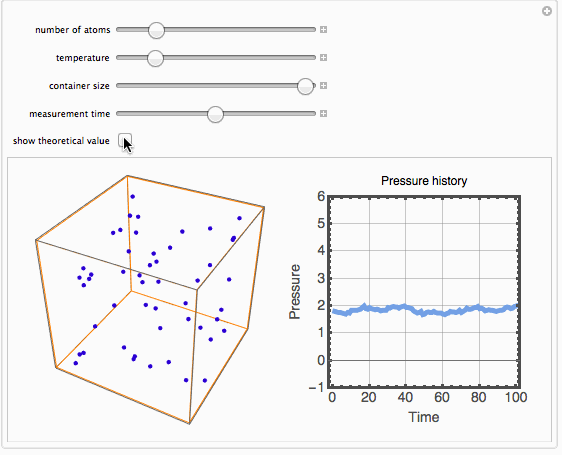

# "Simulation of a Simple Gas Pressure Model" in 3D

There is a cool demonstration project [here](http://demonstrations.wolfram.com/SimulationOfASimpleGasPressureModel/) showing the ideal gas law

where `P` is the pressure, `V` is the volume, `n` is the amount of gas, `R` is the gas constant, and `T` is the temperature of the gas.

Just want it to be presented in 3D:

